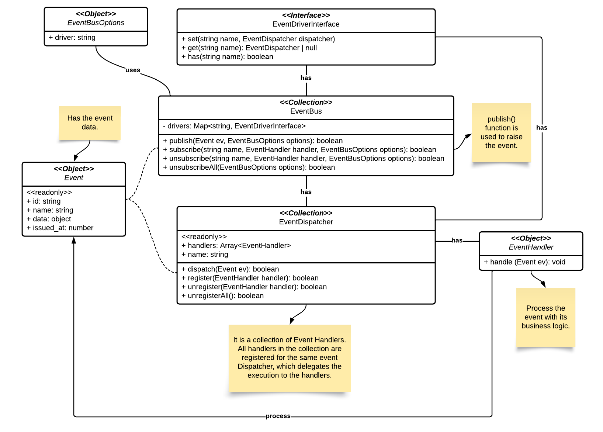

# Event Bus Library

  [](LICENSE)

An ESM/CommonJS library following Oriented-Object Programming pattern to manager an Event Bus. Recommended to server-side application. The main goal is to provide a simple way to publish, subscribe and unsubscribe to local events.

## Features

- Publish, subscribe and unsubscribe to events;
- Change default event driver;
- Singleton & Oriented-Object Programming patterns;
- Better code organization.

This library was a requirement for some internal projects on our company. But it may work with another projects designed following Oriented-Object Programming pattern.



## Use Cases

When you have two microservices, you may want to them comunicate to each other. In the Microservice A you can publish a CLIENT_CREATED event, then:

- A handler send it to RabbitMQ (and Rabbit MQ send it to Microservice B);
- A handler log some event data in a file.

### To remember

1. Before your application starts (or before event to be published), you must subscribe all handlers;
2. Anytime in your application flow, events will be published as needed;
3. Handlers will be executed in the same order that they were subscribed.

## Installation

This library is ready for ES module or CommonJs module. You must add it by using [Node.Js](https://nodejs.org/):

```bash
npm i --save @piggly/event-bus
```

## Usage

First you must import `EventBus` singleton. This is the main entry point for event bus management.

### Registering Drivers

By default, `EventBus` will start with `LocalEventDriver` loaded and get/set dispatcher to it. But you can create your own event driver implementing `EventDriverInterface` with your custom dispatcher extending `EventDispatcher`.

By default, the `publish()`, `subscribe()`, `unsubscribe()` and `unsubscribeAll()` methods will use the `LocalEventDriver`. But, you can change this behavior saying what driver must be loaded. E.g: `publish(event, { driver: 'another' })`. The `another` driver must be registered.

```ts
import EventBus from '@piggly/event-bus';

// Register a new driver
EventBus.instance.register(new AnotherEventDriver());

// Will subscribe on local driver
EventBus.instance.subscribe('EVENT_NAME', new SomeEventHandler());

// Will subscribe on another driver
EventBus.instance.subscribe('EVENT_NAME', new SomeEventHandler(), { driver: 'another' });
```

### Operations

```ts
import EventBus, { AsyncEventHandlerCallback, EventHandlerCallback, EventPayload } from '@piggly/event-bus';

// Sync handler
const callback: EventHandlerCallback<EventPayload> = (e) => {
   console.log('Do something');
};

// Async handler
const asyncCallback: AsyncEventHandlerCallback<EventPayload> = (e) => {
   console.log('Do something');
};

// You can subscribe handlers to events
EventBus.instance.subscribe('EVENT_NAME', callback);
EventBus.instance.subscribe('EVENT_NAME', asyncCallback);

// If needed you can unsubscribe, handler must be the same class that was subscribed
EventBus.instance.unsubscribe('EVENT_NAME', callback);

// When event is ready, just publish it and event bus does what is need
EventBus.instance
   .publish(new EventPayload('EVENT_NAME', {}))
   .then((solved) => {
      if (solved === undefined) {
         console.log('Event was not published');
         return;
      }

      console.log('Event was published');
   })
   .catch(() => {
      console.log('Event was not published');
   });
```

### Handlers & Payloads

For fast implementations, on version `>=2.x.x` handlers are regular functions. They also can be async/await function or return a Promise.

The `AsyncEventHandlerCallback` and `EventHandlerCallback` helps you to define the handler function. They are just a type definition.

The parameter to an event handler is a `EventPayload` object. This object contains the event name and the event data. You can use the `EventPayload` class or create your own class extending it.

```ts
import { EventHandler, EventPayload } from '@piggly/event-bus';

// Type to event data
export type StubEventData = {
   value: number;
};

// Custom class for event payload
// You may use it to validate/parse event data
export class StubEventPayload extends EventPayload<StubEventData> {
   constructor(data: { value: number }) {
      super('STUB_EVENT', data);
   }
}

const eventPayload = new EventPayload('STUB_EVENT', { value: 1 });
const customEventPayload = new StubbEventPayload({ value: 1 });

// Handler for event
const syncHandler = (e: EventPayload<StubEventData>) => {
   console.log(e.name);
   console.log(e.data);
};

const syncHandler = async (e: StubEventPayload) => {
   console.log(e.name);
   console.log(e.data);
};
```

## Changelog

See the [CHANGELOG](CHANGELOG.md) file for information about all code changes.

## Testing the code

This library uses the **Jest**. We carry out tests of all the main features of this application.

```bash
npm run test:once
```

## Contributions

See the [CONTRIBUTING](CONTRIBUTING.md) file for information before submitting your contribution.

## Credits

- [Caique Araujo](https://github.com/caiquearaujo)
- [All contributors](../../contributors)

## License

MIT License (MIT). See [LICENSE](LICENSE).